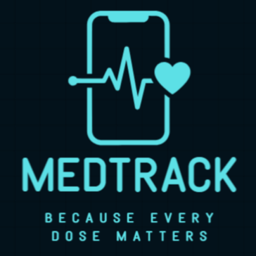
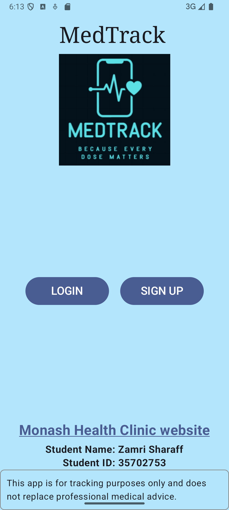
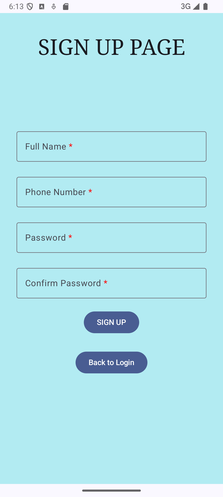
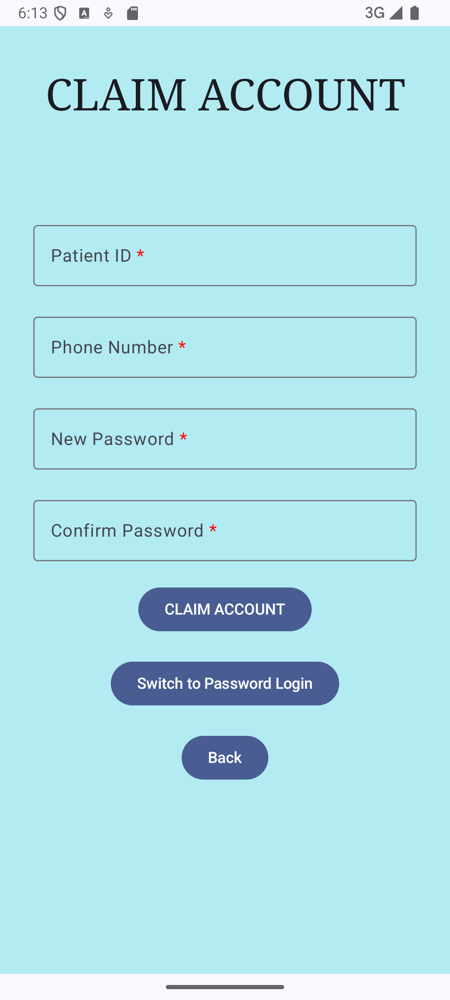
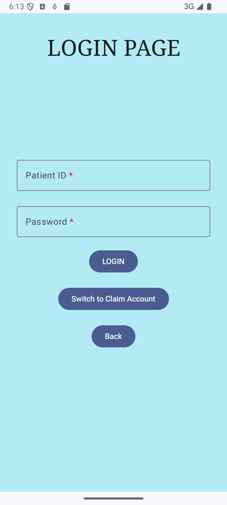
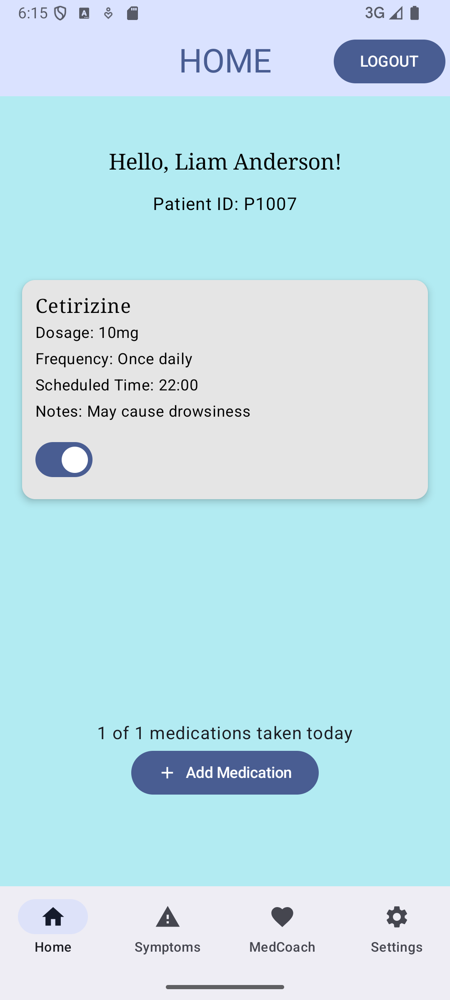
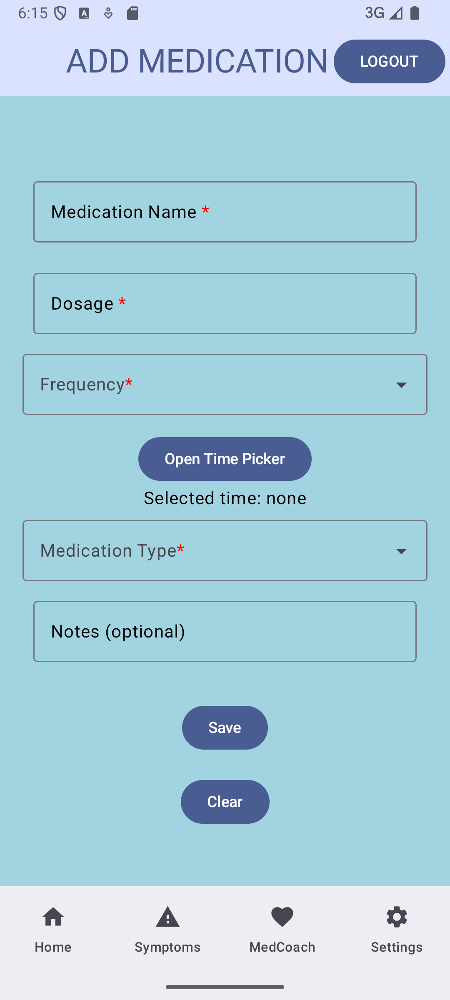
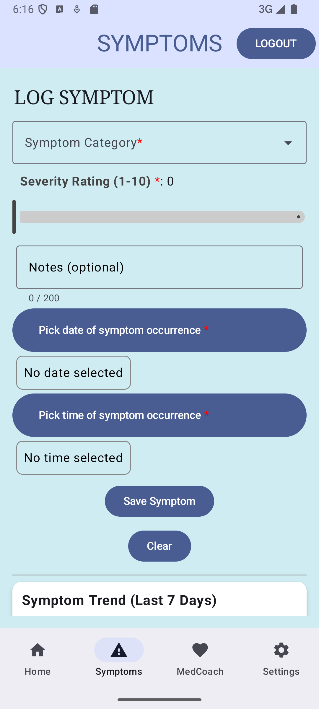
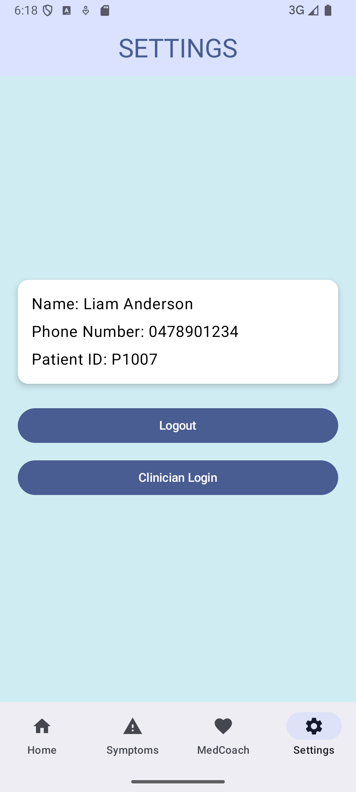
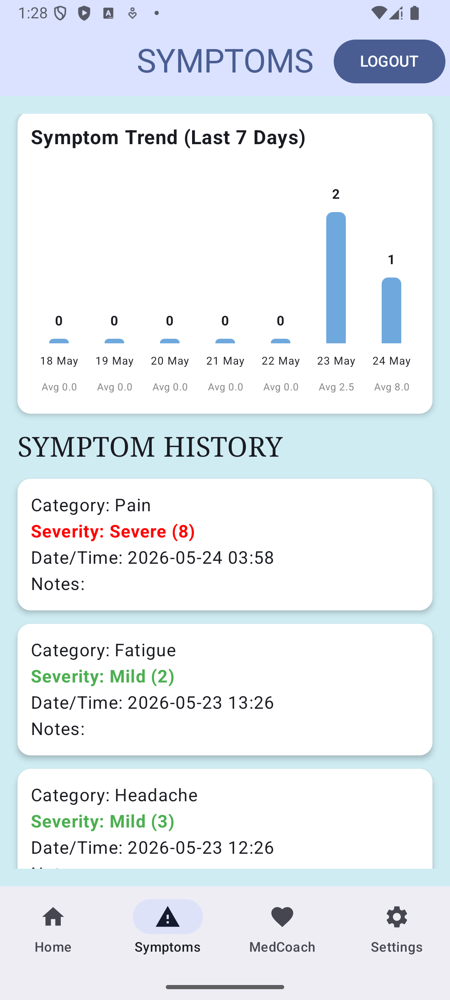

# MedTrackPro

An Android medication and symptom management app built with Kotlin and Jetpack Compose.

[GitHub Repository](https://github.com/ZamriSharaff/MedTrackPro) | [Download APK](https://github.com/ZamriSharaff/MedTrackPro/releases/latest)



## About the project

MedTrackPro is a mobile app for keeping track of medications, symptoms and day-to-day treatment information in one place.

The app lets patients manage their medication schedule, record symptoms, look up drug information, receive personalised medication tips and keep track of which medications they have taken during the day. It also includes a clinician dashboard that provides an overview of the data stored in the app and can generate AI-assisted observations from the aggregate data.

I built the project around a local Room database and an MVVM architecture so that the main application data is persistent and the UI can react to changes as they happen. External services are used where they add something useful: OpenFDA provides drug label information, while Gemini is used for the personalised medication tips and clinician insights.

The app is intended for tracking and demonstration purposes. It does not replace professional medical advice.

## Features

### Patient account and authentication

- Welcome screen with app information, health disclaimer and navigation to Login and Sign Up
- Account registration with validation for name, phone number and password
- Automatic Patient ID generation for new accounts
- First-time account claiming for patients already present in the seeded dataset
- Claiming uses Patient ID and registered phone number before setting a password
- Standard login uses Patient ID and password
- Session persists when the app is closed and reopened
- Logout clears the active session and the activity back stack

### Medication management

- View medications stored for the logged-in patient
- Medication cards show name, dosage, frequency, scheduled time and notes
- Add new medications directly to the Room database
- Frequency and medication type dropdowns
- Time picker for scheduled medication time
- Dosage format validation
- Required field validation with inline errors
- Medication list updates from the database instead of relying on the original CSV after initial setup

### Daily taken tracking

- Each medication has a Taken switch on the Home screen
- The number of medications taken updates immediately
- Taken status is stored in Room
- Taken status is associated with the current date
- Older taken records are cleared when a new day is detected, so the daily checklist starts fresh

### Symptom tracking

- Log symptoms using predefined categories
- Severity rating from 1 to 10
- Optional notes with a 200 character limit
- Date picker and time picker for symptom occurrence
- Severity labels for Mild, Moderate and Severe symptoms
- Symptom history stored in Room and displayed with the newest entries first
- Inline validation for incomplete or invalid entries

### Symptom Trend

MedTrackPro includes an original Symptom Trend feature that uses the patient's stored symptom history to show activity over the last seven days.

The chart calculates:

- Number of symptom entries recorded on each day
- Average severity for each day
- A seven-day view so recent changes can be spotted without manually comparing individual history entries

The chart is calculated from Room data through `SymptomsViewModel`, so it updates from the same source used by the symptom history.

### MedCoach

The MedCoach screen combines external drug information with AI-generated medication guidance.

#### Drug information

- Medication search field with suggestions from the patient's saved medications
- OpenFDA Drug Label API integration using Retrofit and coroutines
- Displays the medication name, purpose, warnings and dosage or administration information when available
- Handles unknown medications and network failures with user-friendly error messages
- OpenFDA responses return several fields as arrays, so the app extracts the first available value for display

#### GenAI medication tips

- Generate a short personalised medication adherence tip
- The prompt includes patient-specific information such as the patient's name, saved medications and recent symptoms
- Generated tips are stored in the Room database
- Latest generated tip is shown directly on the MedCoach screen
- Previous tips can be viewed through the Show All Tips dialog
- Tip history is kept separately for each patient
- Gemini failures are handled with user-friendly messages rather than exposing raw API responses
- Temporary Gemini failures can be retried before showing an error

### Clinician dashboard

The clinician area provides an aggregate view of the data stored in the app.

- Clinician access key protected login
- Total number of patients
- Average number of medications per patient
- Most common symptom category
- Average symptom severity
- Find Patterns button for AI-generated observations
- Generated insights are based on the aggregate database values rather than individual patient records
- Insights are displayed directly on the dashboard

The demo clinician access key is (lowercase only):

```text
dollar-entry-apples
```

## Technologies

- Kotlin
- Jetpack Compose
- Material 3
- AndroidX
- Room Database
- Kotlin Coroutines
- StateFlow and SharedFlow
- MVVM architecture
- Repository pattern
- Retrofit
- Gson
- OpenFDA Drug Label API
- Google Gemini API
- Gradle Version Catalog
- Android Studio
- Git and GitHub

## Architecture

MedTrackPro follows a ViewModel driven MVVM structure.

```text
Compose UI
    ↓
ViewModel
    ↓
Repository
    ↓
DAO / Network Repository
    ↓
Room Database / OpenFDA API / Gemini API
```

### View layer

The UI is built with Jetpack Compose. Each main screen collects its state from a ViewModel and sends user actions back to that ViewModel.

The main screens are implemented as Compose-backed Activities:

- Welcome
- Login/Claim Account
- Sign Up
- Home
- Add Medication
- Symptoms
- MedCoach
- Settings
- Clinician Login
- Clinician Dashboard

### ViewModels

Each feature has its own ViewModel responsible for UI state, validation and actions.

| ViewModel                | Main responsibility                            |
|--------------------------|------------------------------------------------|
| `LoginViewModel`         | Login and first-time account claiming          |
| `SignUpViewModel`        | Account creation and validation                |
| `HomeViewModel`          | Patient greeting, medications and taken status |
| `AddMedicationViewModel` | Medication form validation and database writes |
| `SymptomsViewModel`      | Symptom logging, history and trend calculation |
| `MedCoachViewModel`      | Drug lookup, Gemini tips and tip history       |
| `SettingsViewModel`      | Logged-in user information and logout          |
| `ClinicianViewModel`     | Aggregate statistics and Gemini insights       |

### Repository layer

`MedTrackRepository` keeps database operations in one place and prevents the UI from calling Room directly. ViewModels use repository functions for patient, medication, symptom, taken-status and MedCoach operations.

The external drug lookup has a separate `MedInfoRepository`, which handles the OpenFDA request and converts API responses into app-friendly result types.

## Database

Room is the main storage layer for application data.

### Tables

| Table               | Purpose                                                   |
|---------------------|-----------------------------------------------------------|
| `PatientEntity`     | Patient profile, phone number and locally stored password |
| `MedicationEntity`  | Medication name, dosage, frequency, time, type and notes  |
| `SymptomEntity`     | Symptom category, severity, notes and date/time           |
| `MedCoachTipEntity` | AI-generated medication tips and creation timestamps      |
| `TakenStatusEntity` | Daily taken state for each medication                     |

`MedicationEntity`, `SymptomEntity`, `MedCoachTipEntity` and `TakenStatusEntity` are associated with a patient through a `patientId` foreign key.

### First-launch database setup

The project includes sample data in the app's `assets/` folder:

```text
app/src/main/assets/
    patients.csv
    medications.csv
    symptoms.csv
```

On the first launch, `DatabaseSeeder` loads the CSV data into Room and sets a `db_seeded` flag in SharedPreferences. After the database has been seeded, normal application reads and writes use Room rather than reading from the CSV files again.

The seeder also handles migration of legacy user accounts and user-added medications from the earlier SharedPreferences data format when those records are present. After migration, the old `users` and `medications` SharedPreferences entries are removed.

### Session storage

SharedPreferences is kept for lightweight session information rather than application data.

The active patient ID is stored through `SessionManager`, which allows the app to restore the logged-in state after an app restart.

## Authentication flow

There are two different login paths for patients.

### Existing seeded patient

A patient that came from the bundled dataset starts without a password in Room because CSV passwords are not imported.

The patient can claim the account using:

```text
Patient ID
Phone Number
New Password
Confirm Password
```

Once the account has been claimed, future logins use:

```text
Patient ID
Password
```

### New patient registration

A new user can create an account from the Sign Up screen.

The form checks:

- Required fields
- Australian style phone number format beginning with `04`
- Exactly 10 digits
- Password length of at least 8 characters
- At least one letter
- At least one digit
- Matching confirmation password
- Phone number uniqueness

A new Patient ID is generated by finding the highest existing patient number in Room and incrementing it.

## API integration

### OpenFDA

MedTrackPro uses the OpenFDA Drug Label API for medication information.

Base endpoint:

```text
https://api.fda.gov/drug/label.json
```

A lookup uses the patient's selected or entered medication name, for example:

```text
?search=openfda.brand_name:"ibuprofen"&limit=1
```

The response is mapped into a small set of fields used by the app:

- Brand name
- Purpose
- Warnings
- Dosage and administration

Retrofit handles the request and Gson maps the JSON response into Kotlin data classes.

OpenFDA does not require an API key for this integration.

### Gemini

Gemini is used in two places:

1. MedCoach generates personalised medication adherence tips.
2. The Clinician Dashboard generates three data-driven observations from aggregate database statistics.

The Gemini key is intentionally not stored in the Git repository.

## Gemini API setup

The downloadable demo APK is prebuilt with the Gemini configuration used for the project, so Gemini features can be used without entering an API key on the device.

When building MedTrackPro from source, a Gemini API key is required for the AI features. The rest of the application can run without Gemini being configured.

Create a key through Google AI Studio:

https://aistudio.google.com/api-keys

Then create `local.properties` in the project root if it does not already exist and add:

```properties
apiKey=YOUR_GEMINI_API_KEY
```

The repository already ignores `local.properties`, so it should not be committed to GitHub.

After adding the key:

1. Open the project in Android Studio.
2. Sync the Gradle project.
3. Build and run the app.
4. Open MedCoach and use `Generate Tip`.
5. Open the Clinician Dashboard and use `Find Patterns`.

Do not replace the placeholder in the README with a real API key and do not commit your local key to source control.

## Screenshots

Selected screenshots from the current project are shown below.

### Welcome and authentication

| Welcome                             | Sign Up                            |
|-------------------------------------|------------------------------------|
|  |  |

| Claim Account                                   |  Login                          |
|-------------------------------------------------|---------------------------------|
|  |  |

### Main patient screens

| Home                          |  Add Medication                                   |
|-------------------------------|---------------------------------------------------|
|  |  |

| Symptoms                              |  Settings                             |
|---------------------------------------|---------------------------------------|
|  |  |

### Symptom Trend



## Project structure

```text
MedTrackPro/
├── app/
│   ├── src/
│   │   ├── main/
│   │   │   ├── assets/
│   │   │   │   ├── patients.csv
│   │   │   │   ├── medications.csv
│   │   │   │   └── symptoms.csv
│   │   │   ├── java/com/zamri/s35702753/medtrack/
│   │   │   │   ├── AddMedicationScreen.kt
│   │   │   │   ├── ClinicianDashboardScreen.kt
│   │   │   │   ├── ClinicianLoginScreen.kt
│   │   │   │   ├── HomeScreen.kt
│   │   │   │   ├── LoginScreen.kt
│   │   │   │   ├── MainActivity.kt
│   │   │   │   ├── MedCoachScreen.kt
│   │   │   │   ├── MedTrackApplication.kt
│   │   │   │   ├── SettingsScreen.kt
│   │   │   │   ├── SignUpScreen.kt
│   │   │   │   ├── SymptomsScreen.kt
│   │   │   │   ├── data/
│   │   │   │   │   ├── DatabaseSeeder.kt
│   │   │   │   │   ├── MedTrackDatabase.kt
│   │   │   │   │   ├── MedTrackRepository.kt
│   │   │   │   │   ├── MedTrackViewModelFactory.kt
│   │   │   │   │   ├── PatientEntity.kt
│   │   │   │   │   ├── MedicationEntity.kt
│   │   │   │   │   ├── SymptomEntity.kt
│   │   │   │   │   ├── MedCoachTipEntity.kt
│   │   │   │   │   ├── TakenStatusEntity.kt
│   │   │   │   │   ├── PatientDao.kt
│   │   │   │   │   ├── MedicationDao.kt
│   │   │   │   │   ├── SymptomDao.kt
│   │   │   │   │   ├── MedCoachTipDao.kt
│   │   │   │   │   ├── TakenStatusDao.kt
│   │   │   │   │   └── SessionManager.kt
│   │   │   │   ├── data/network/
│   │   │   │   │   ├── APIService.kt
│   │   │   │   │   ├── DrugLabelModels.kt
│   │   │   │   │   ├── MedInfoRepository.kt
│   │   │   │   │   └── ResponseModel.kt
│   │   │   │   ├── ui/theme/
│   │   │   │   └── viewmodel/
│   │   │   │       ├── AddMedicationViewModel.kt
│   │   │   │       ├── ClinicianViewModel.kt
│   │   │   │       ├── HomeViewModel.kt
│   │   │   │       ├── LoginViewModel.kt
│   │   │   │       ├── MedCoachViewModel.kt
│   │   │   │       ├── SettingsViewModel.kt
│   │   │   │       ├── SignUpViewModel.kt
│   │   │   │       └── SymptomsViewModel.kt
│   │   │   └── res/
│   │   ├── test/
│   │   └── androidTest/
│   └── build.gradle.kts
├── gradle/
│   ├── libs.versions.toml
│   └── wrapper/
├── build.gradle.kts
├── gradle.properties
├── gradlew
├── gradlew.bat
├── settings.gradle.kts
├── .gitignore
└── README.md
```

### Key file descriptions

| File                          |  Purpose                                                                             |
|-------------------------------|--------------------------------------------------------------------------------------|
| `MainActivity.kt`             | Starts the app, handles first-launch setup and restores an active session            |
| `MedTrackApplication.kt`      | Creates the Room database, repository and session manager                            |
| `DatabaseSeeder.kt`           | Seeds the Room database from the bundled CSV files and handles legacy data migration |
| `MedTrackDatabase.kt`         | Room database definition                                                             |
| `MedTrackRepository.kt`       | Central data access layer between ViewModels and DAOs                                |
| `MedTrackViewModelFactory.kt` | Supplies shared repository and session dependencies to ViewModels                    |
| `SessionManager.kt`           | Stores and clears the currently logged-in patient ID                                 |
| `APIService.kt`               | Retrofit interface for the OpenFDA API                                               |
| `MedInfoRepository.kt`        | Performs drug searches and converts API results into app-friendly states             |
| `MedCoachViewModel.kt`        | Handles drug lookup, patient context, Gemini tips and tip history                    |
| `ClinicianViewModel.kt`       | Loads aggregate database statistics and generates clinician insights                 |
| `SymptomsViewModel.kt`        | Handles symptom logging, history and the seven-day trend calculation                 |

## Running the project locally

### Requirements

- Android Studio
- Android SDK with API 35 or higher
- A physical Android device or emulator running API 35 or higher
- Internet access for OpenFDA and Gemini features
- A Gemini API key for the AI features

### Setup

1. Clone the repository:

```bash
git clone https://github.com/ZamriSharaff/MedTrackPro.git
cd MedTrackPro
```

2. Open the project in Android Studio.

3. Create or edit `local.properties` in the project root and add your Gemini API key:

```properties
apiKey=YOUR_GEMINI_API_KEY
```

4. Let Android Studio sync the Gradle project.

5. Build and run the application.

The database is created locally on the device. On first launch, the bundled CSV files are imported into Room.

### Demo patient account

The bundled sample data includes patients that can claim their accounts through the Claim Account flow.

For example:

```text
Patient ID: P1007
Phone Number: 0478901234
```

Choose a new password that satisfies the password rules during account claiming.

After claiming the account once, use the generated login credentials through the normal Password Login flow.

## Typical user flow

```text
Welcome
   │
   ├── Sign Up ──> Create account ──> Password Login ──> Home
   │
   └── Login
         │
         ├── Claim Account ──> Set password ──> Home
         │
         └── Password Login ──────────────────> Home

Home
 ├── Add Medication
 ├── Symptoms
 ├── MedCoach
 └── Settings
         │
         └── Clinician Login ──> Clinician Dashboard
```

## Design decisions

### Room as the main source of truth

The original bundled CSV files are useful for providing initial sample data, but they are not suitable as the main storage layer for a persistent application. I use Room as the source of truth once the app has seeded its database.

This means medication changes, symptom entries, user accounts, taken status and MedCoach history all remain available after navigating between screens and restarting the application.

### Repository plus ViewModels

I kept database access out of the composables. ViewModels expose `StateFlow` and handle user actions, while the repository is responsible for talking to Room. This keeps UI code focused on rendering and interaction instead of mixing it with persistence code.

### Separate taken-status table

Taken state is stored separately from the medication itself because it is time-dependent. Each record contains the patient, medication, date and taken state. This makes it possible to keep today's checklist persistent while clearing previous days when a new date is detected.

### Patient-specific AI context

The MedCoach prompt does not rely only on a generic message. It includes patient-specific context from Room, such as the patient's name, medication list and recent symptoms. This gives the generated response more context while still keeping the output focused on medication adherence.

### AI output is stored

Generated MedCoach tips are inserted into Room rather than being treated as temporary text. This allows users to review previous tips later through the history dialog.

### Defensive handling of external services

The app treats OpenFDA and Gemini as external dependencies that can fail. Drug lookup failures are converted into user-friendly messages, while Gemini errors are handled separately for missing credentials, temporary service failures and other request problems.

## Validation and error handling

The app includes validation throughout the main user flows.

Examples include:

- Required account and medication fields
- Phone number format
- Password rules
- Matching passwords
- Unique phone numbers
- Dosage format such as `500mg`, `10ml` and `2.5g`
- Symptom severity range
- Symptom note length
- Date and time selection
- Empty medication searches
- OpenFDA unknown-drug and network errors
- Missing Gemini configuration and Gemini service failures

## Testing

The project currently uses Android Studio's unit-test and instrumented-test structure, but it does not yet contain a large dedicated automated test suite.

Most application functionality has been verified through manual end-to-end testing of the main user flows, including authentication, Room persistence, medication tracking, symptom logging, OpenFDA lookup, MedCoach history, taken-state persistence and clinician dashboard behaviour.

A natural next step would be adding focused unit tests for validation and ViewModel logic, along with UI tests for the most important user flows.

## Security and privacy notes

This project is designed as a portfolio application and uses local storage for its data.

- The Gemini API key is not included in the repository.
- `local.properties` is ignored by Git.
- No real patient information should be used with this project.
- Authentication is local and does not use a backend identity provider.
- Passwords are stored in the local Room database, so the current implementation should not be treated as production-grade authentication.
- The app is for tracking purposes and is not intended to diagnose, treat or replace professional medical advice.

For a production version, I would move authentication and sensitive data to a secured backend, hash passwords rather than storing them directly, and keep AI credentials behind a server-side API layer.

## Project status and future improvements

MedTrackPro currently covers the main medication, symptom, database, API, AI and clinician workflows in the project.

Some areas I would improve in a production-oriented version are:

- Backend authentication with secure password hashing
- Server side handling of Gemini requests and API credentials
- Automated unit and UI test coverage
- Push notifications or reminders for scheduled medications
- More detailed medication analytics and adherence history
- Better accessibility support across the UI
- A more complete clinical data model for larger datasets

## External services

### OpenFDA Drug Label API

https://open.fda.gov/apis/drug/label/

The app uses the Drug Label API to retrieve public medication label information.

### Google AI Studio / Gemini API

https://aistudio.google.com/api-keys

Gemini is used for the personalised medication tips and aggregate clinician insights.

## License

No open-source license has currently been added to this project.

## Author

Zamri Sharaff

[GitHub](https://github.com/ZamriSharaff)

[MedTrackPro Repository](https://github.com/ZamriSharaff/MedTrackPro)
